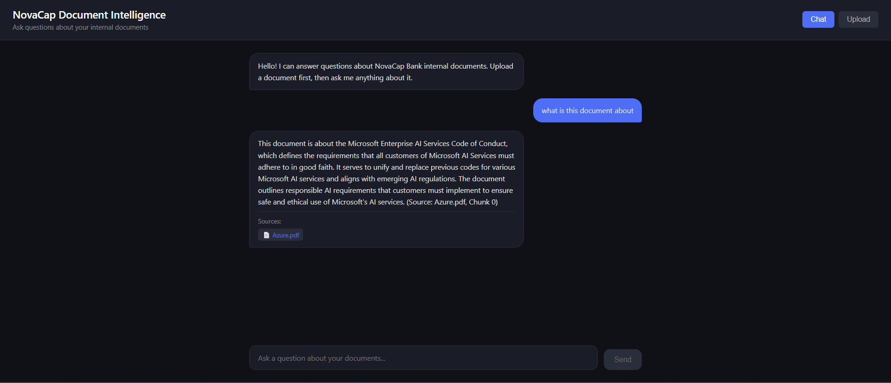
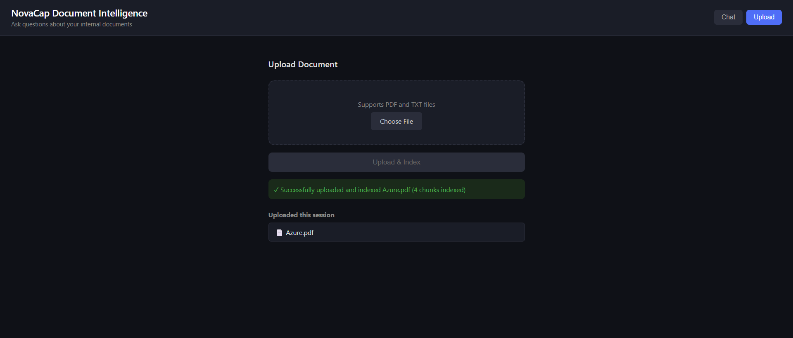

# NovaCap Document Intelligence

An enterprise RAG (Retrieval-Augmented Generation) platform built for NovaCap Bank. Employees upload internal documents and ask questions in natural language — getting accurate, cited answers powered by Azure AI Search and OpenAI.

> Built as part of an AI Engineer upskilling roadmap targeting senior AI Engineer and AI Solution Architect roles.

## Live Demo
- **Frontend:** https://blue-cliff-03780ed0f.7.azurestaticapps.net
- **API:** https://novacap-backend.bravebeach-bb6dfe67.eastus.azurecontainerapps.io
- **Swagger Docs:** https://novacap-backend.bravebeach-bb6dfe67.eastus.azurecontainerapps.io/docs

## Screenshots

### Chat Interface


### Document Upload


## How It Works

1. Employee uploads a PDF or TXT document
2. Document is stored in **Azure Blob Storage**
3. Document is chunked and indexed in **Azure AI Search** with vector embeddings
4. Employee asks a question in the chat interface
5. Question is converted to a vector using **OpenAI text-embedding-3-small**
6. Semantically relevant chunks are retrieved from Azure AI Search
7. **OpenAI GPT-4o-mini** generates a grounded answer using only the retrieved context
8. Answer is returned with source citations — no hallucination

## Architecture

```
PDF Upload → Azure Blob Storage → Chunking Pipeline → Embeddings (text-embedding-3-small)
                                                              ↓
                                              Azure AI Search Index (vector + keyword)
                                                              ↓
User Question → Embedding → Vector Search → OpenAI GPT-4o-mini → Cited Answer
```

## Tech Stack

| Layer | Technology |
|---|---|
| Frontend | React + Vite |
| Backend | FastAPI (Python) |
| Containerization | Docker |
| Hosting | Azure Container Apps |
| Container Registry | Azure Container Registry |
| Document Storage | Azure Blob Storage |
| Search & Retrieval | Azure AI Search (hybrid vector + keyword) |
| Embeddings | OpenAI text-embedding-3-small |
| LLM | OpenAI GPT-4o-mini |
| Authentication | Azure Service Principal + RBAC |
| Document Parsing | pypdf |
| Observability | Azure Monitor + Log Analytics |

## Project Structure

```
novacap-doc-intelligence/
├── backend/
│   ├── main.py                  # FastAPI app entry point
│   ├── Dockerfile               # Container definition
│   ├── routers/
│   │   ├── upload.py            # Document upload, chunking, embedding, indexing
│   │   ├── search.py            # Document search endpoint
│   │   └── chat.py              # RAG chat endpoint
│   ├── services/
│   │   ├── blob_service.py      # Azure Blob Storage operations
│   │   ├── search_service.py    # Azure AI Search vector + keyword operations
│   │   └── llm_service.py       # OpenAI embeddings and chat completion
│   └── requirements.txt
├── frontend/
│   └── src/
│       ├── App.jsx
│       └── components/
│           ├── Chat.jsx         # Chat UI with source citations
│           └── Upload.jsx       # Document upload UI
└── README.md
```

## API Endpoints

| Method | Endpoint | Description |
|---|---|---|
| POST | `/api/upload` | Upload, chunk, embed and index a PDF or TXT document |
| GET | `/api/search?q=query` | Search indexed documents |
| POST | `/api/chat` | Ask a question, get a grounded answer with sources |

## Local Setup

### Prerequisites
- Python 3.10+
- Node.js 18+
- Docker Desktop
- Azure account with AI Search and Blob Storage resources
- OpenAI API key
- Azure CLI installed and logged in (`az login`)

### Backend

```bash
cd backend
python -m venv venv
venv\Scripts\activate
pip install -r requirements.txt
```

Create a `.env` file based on `.env.example`:

```
AZURE_STORAGE_ACCOUNT=your-storage-account-name
AZURE_SEARCH_ENDPOINT=https://your-search-service.search.windows.net
AZURE_SEARCH_INDEX=novacap-documents
OPENAI_API_KEY=your-openai-api-key
```

Run the backend:

```bash
uvicorn main:app --reload
```

API available at `http://localhost:8000`
Swagger docs at `http://localhost:8000/docs`

### Frontend

```bash
cd frontend
npm install
npm run dev
```

Frontend available at `http://localhost:5173`

### Docker

```bash
cd backend
docker build -t novacap-backend .
docker run -p 8000:8000 --env-file .env novacap-backend
```

## Azure Resources Required

- **Azure Blob Storage** — document storage container
- **Azure AI Search** — vector + keyword search index
- **Azure Container Registry** — private Docker image registry
- **Azure Container Apps** — serverless container hosting
- **RBAC Roles needed:**
  - `Storage Blob Data Contributor` on the storage account
  - `Search Index Data Contributor` on the AI Search service

## Key Technical Decisions

- **Hybrid search** — combines vector similarity search with keyword search for better retrieval accuracy
- **text-embedding-3-small** — OpenAI's efficient embedding model, 1536 dimensions, low cost
- **Service Principal auth** — dedicated app identity with scoped RBAC roles, no hardcoded credentials
- **DefaultAzureCredential** — uses Azure CLI locally, service principal in production, same code both environments
- **Chunking with overlap** — documents split into 500-word chunks with 50-word overlap to preserve context across chunk boundaries
- **Grounded responses** — LLM instructed to answer only from retrieved context, refuses to answer if information isn't in the documents
- **Source citations** — every answer includes the source document and chunk number so users can verify

## Roadmap

- [x] Vector search with embeddings (semantic similarity)
- [x] Docker containerization
- [x] Deploy to Azure Container Apps
- [x] Deploy frontend to Azure Static Web Apps
- [ ] Azure APIM gateway with rate limiting
- [ ] Role-based access control per department
- [ ] Azure Monitor query logging and audit trail
- [ ] Support for Word documents (.docx)